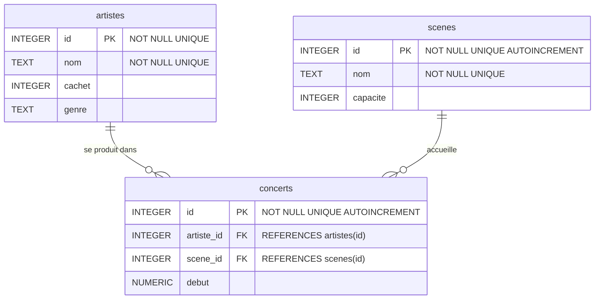

## Cours 4

## Introduction

- La semaine dernière, nous avons appris à concevoir nos propres schémas de base de données. Dans ce cours, nous allons explorer comment **ajouter**, **modifier** et **supprimer** des données dans nos bases de données.
- Notre festival de musique a maintenant un schéma bien défini, avec des tables pour les artistes, les scènes et les concerts. Mais ces tables sont vides ! Un festival sans artistes ni concerts, ce n'est pas très utile.
- Quand un nouvel artiste est confirmé pour le festival, on doit **insérer** ses données dans la base. Si son cachet change, on doit **mettre à jour** les données. Et si un artiste annule, on doit **supprimer** les données correspondantes.
- Concentrons-nous d'abord sur l'**insertion** de données dans notre base `festival.db`.

## Rappel du Schéma


- Rappelons le schéma de notre base de données, tel que nous l'avons créé la semaine dernière. On peut le vérifier de deux façons :

**Terminal** :

```sql
.schema
```

**DB Browser for SQLite** : ouvrir `festival.db`, puis aller dans l'onglet **« Structure de la base de données »** (Database Structure). On y voit la liste des tables et leurs colonnes. On peut aussi faire clic droit sur une table → **« Modifier la table »** pour voir les types et contraintes.

- Nos trois tables principales sont :

```sql
CREATE TABLE "artistes" (
    "id" INTEGER,
    "nom" TEXT NOT NULL,
    "genre" TEXT,
    "cachet" REAL NOT NULL CHECK("cachet" > 0),
    PRIMARY KEY("id")
);

CREATE TABLE "scenes" (
    "id" INTEGER,
    "nom" TEXT NOT NULL UNIQUE,
    "capacite" INTEGER NOT NULL CHECK("capacite" > 0),
    PRIMARY KEY("id")
);

CREATE TABLE "concerts" (
    "artiste_id" INTEGER,
    "scene_id" INTEGER,
    "debut" NUMERIC NOT NULL DEFAULT CURRENT_TIMESTAMP,
    FOREIGN KEY("artiste_id") REFERENCES "artistes"("id"),
    FOREIGN KEY("scene_id") REFERENCES "scenes"("id")
);
```

- Chaque ligne de la table `artistes` contient le nom d'un artiste, son genre musical et son cachet. Chaque ligne de `scenes` contient le nom d'une scène et sa capacité. La table `concerts` relie un artiste à une scène avec une date de début.
- Pour confirmer que les tables sont vides, on peut exécuter :

```sql
SELECT * FROM "artistes";
```

- **Dans DB Browser** : aller dans l'onglet **« Parcourir les données »** (Browse Data) et sélectionner la table `artistes` dans le menu déroulant. La table apparaît vide.
- Cela devrait donner un résultat vide, car la table ne contient encore aucune donnée.

## Insérer des Données

- L'instruction SQL `INSERT INTO` est utilisée pour insérer une ligne de données dans une table donnée.

**Terminal** : on tape la commande directement dans `sqlite3`.

**DB Browser** : aller dans l'onglet **« Exécuter le SQL »** (Execute SQL), taper la commande, puis cliquer sur ▶️ (ou Ctrl+Entrée). On peut aussi utiliser l'onglet **« Parcourir les données »** et cliquer sur **« Nouvel enregistrement »** pour insérer une ligne via l'interface graphique — mais on préfère écrire le SQL à la main pour apprendre !

```sql
INSERT INTO "artistes" ("id", "nom", "genre", "cachet")
VALUES (1, 'PLK', 'Rap', 45000);
```

- On voit que cette commande nécessite la liste des colonnes de la table qui recevront de nouvelles données, et les valeurs à ajouter dans chaque colonne, dans le même ordre.
- L'exécution de la commande `INSERT INTO` ne retourne rien, mais on peut exécuter une requête pour confirmer que la ligne est maintenant présente dans `artistes`.

```sql
SELECT * FROM "artistes";
```

- On peut ajouter plus de lignes en insérant plusieurs fois. Cependant, taper la valeur de la clé primaire manuellement (1, 2, 3 etc.) peut entraîner des erreurs. Heureusement, SQLite peut remplir les valeurs de clé primaire automatiquement. Pour utiliser cette fonctionnalité, on omet complètement la colonne ID lors de l'insertion d'une ligne.

```sql
INSERT INTO "artistes" ("nom", "genre", "cachet")
VALUES ('Jorja Smith', 'R&B', 60000);
```

- On peut vérifier que cette ligne a été insérée avec un `id` de 2 en exécutant :

```sql
SELECT * FROM "artistes";
```

- Remarquez que la façon dont SQLite remplit les valeurs de clé primaire est d'incrémenter la clé primaire précédente — dans ce cas, 1.

### Questions

> Si on supprime une ligne avec la clé primaire 1, est-ce que SQLite assignera automatiquement une clé primaire de 1 à la prochaine ligne insérée ?

- Non, SQLite sélectionne en fait la valeur de clé primaire la plus élevée dans la table et l'incrémente pour générer la prochaine valeur de clé primaire.

## Respect des Contraintes

- Rappelez-vous que notre schéma impose des contraintes. Le nom d'un artiste est `NOT NULL` et le cachet doit être supérieur à 0 (`CHECK("cachet" > 0)`).
- Si on essaie d'insérer une ligne avec un nom NULL :

```sql
INSERT INTO "artistes" ("nom", "genre", "cachet")
VALUES (NULL, 'Pop', 30000);
```

- On obtient une erreur : `Runtime error: NOT NULL constraint failed: artistes.nom`. Cette erreur nous informe que la ligne qu'on essaie d'insérer viole une contrainte du schéma.
- De même, si on essaie d'insérer un artiste avec un cachet de 0 :

```sql
INSERT INTO "artistes" ("nom", "genre", "cachet")
VALUES ('Test', 'Pop', 0);
```

- On obtient : `Runtime error: CHECK constraint failed: cachet > 0`.
- Pour les scènes, rappelons que le nom est `NOT NULL UNIQUE`. Si on insère une scène :

```sql
INSERT INTO "scenes" ("nom", "capacite")
VALUES ('Grande Scène', 5000);
```

- Et qu'on essaie d'insérer une autre scène avec le même nom :

```sql
INSERT INTO "scenes" ("nom", "capacite")
VALUES ('Grande Scène', 3000);
```

- On obtient : `Runtime error: UNIQUE constraint failed: scenes.nom`.
- De cette manière, les contraintes du schéma sont des garde-fous qui nous protègent contre l'ajout de lignes non conformes au schéma de notre base de données.

## Insérer Plusieurs Lignes

- On peut avoir besoin d'insérer plus d'une ligne à la fois. Une façon de le faire est de séparer les lignes avec des virgules dans la commande `INSERT INTO`.

```sql
INSERT INTO "artistes" ("nom", "genre", "cachet")
VALUES
('SDM', 'Rap', 35000),
('Pomme', 'Pop', 25000),
('Aya Nakamura', 'Pop', 80000);
```

- Insérer plusieurs lignes à la fois de cette manière est plus pratique et aussi plus rapide et efficace.
- Insérons maintenant les scènes de notre festival :

```sql
INSERT INTO "scenes" ("nom", "capacite")
VALUES
('Chapiteau', 800),
('Scène Électro', 1200);
```

- Pour voir les tables mises à jour, on peut sélectionner toutes les lignes :

```sql
SELECT * FROM "artistes";
SELECT * FROM "scenes";
```

### Importer depuis un CSV

- Nos données pourraient aussi être stockées dans un fichier CSV (comma-separated values). SQLite permet d'importer un fichier CSV directement dans notre base de données.
- Imaginons un fichier `artistes.csv` :

```
nom,genre,cachet
Orelsan,Rap,70000
Clara Luciani,Pop,40000
Justice,Électro,55000
```

**Terminal** : on utilise la commande `.import` pour importer le CSV dans une table temporaire :

```sql
.import --csv artistes.csv temp
```

- SQLite reconnaît la première ligne du CSV comme en-tête et la convertit en noms de colonnes pour la table `temp`.

**DB Browser** : aller dans le menu **Fichier → Importer → Table depuis un fichier CSV…** Sélectionner `artistes.csv`. DB Browser propose de créer une nouvelle table (on peut la nommer `temp`). Il détecte automatiquement les en-têtes et les séparateurs.

- Dans les deux cas, on peut voir les données importées avec :

```sql
SELECT * FROM "temp";
```

- Ensuite, on déplace les données vers la table `artistes`, qui a les bonnes contraintes et les clés primaires auto-incrémentées :

```sql
INSERT INTO "artistes" ("nom", "genre", "cachet")
SELECT "nom", "genre", "cachet" FROM "temp";
```

- SQLite ajoutera automatiquement les valeurs de clé primaire dans la colonne `id`.
- Pour nettoyer, on supprime la table temporaire :

```sql
DROP TABLE "temp";
```

### Questions

> Que se passe-t-il si l'une des lignes qu'on essaie d'insérer viole une contrainte ?

- Si on essaie d'insérer plusieurs lignes et que même une seule d'entre elles viole une contrainte, la commande entière échoue et **aucune** des lignes n'est insérée !

> Après avoir importé des données depuis le CSV, une des cellules était vide et non NULL. Pourquoi ?

- Quand on importe des données depuis un CSV, une valeur manquante est interprétée comme du texte vide, pas comme NULL. On peut ensuite exécuter des requêtes pour convertir ces valeurs vides en NULL si nécessaire.

## Insérer des Concerts

- Maintenant qu'on a des artistes et des scènes, on peut programmer des concerts. La table `concerts` utilise des clés étrangères pour relier un artiste à une scène.

```sql
INSERT INTO "concerts" ("artiste_id", "scene_id", "debut")
VALUES (1, 1, '2025-07-10 20:00');
```

- Cette ligne programme PLK (id 1) sur la Grande Scène (id 1) le 10 juillet à 20h.
- On peut aussi programmer plusieurs concerts d'un coup :

```sql
INSERT INTO "concerts" ("artiste_id", "scene_id", "debut")
VALUES
(2, 1, '2025-07-10 22:00'),
(1, 2, '2025-07-11 18:00'),
(3, 2, '2025-07-11 20:00');
```

- Remarquez que PLK (id 1) joue deux fois : une fois sur la Grande Scène et une fois au Chapiteau. C'est possible parce qu'on n'a pas mis de clé primaire composée sur `("artiste_id", "scene_id")` — ce qui nous avait été expliqué la semaine dernière.
- Si on omet la colonne `debut`, la valeur par défaut `CURRENT_TIMESTAMP` sera utilisée :

```sql
INSERT INTO "concerts" ("artiste_id", "scene_id")
VALUES (4, 3);
```

- En faisant `SELECT * FROM "concerts";`, on voit que la date de début de ce concert est l'horodatage du moment de l'insertion.

## Supprimer des Données

- La commande suivante supprimerait **toutes** les lignes de la table `artistes`. (On ne veut pas exécuter cela maintenant !)

```sql
DELETE FROM "artistes";
```

- **Dans DB Browser** : on peut aussi supprimer une ligne en la sélectionnant dans l'onglet « Parcourir les données » puis en cliquant sur **« Supprimer l'enregistrement »**. Mais attention : il faut ensuite cliquer sur **« Écrire les modifications »** (Write Changes) pour que la suppression soit effectivement enregistrée dans le fichier `.db`. C'est vrai pour toutes les modifications faites via l'interface graphique !

- On peut aussi supprimer des lignes qui correspondent à des conditions spécifiques. Par exemple, pour supprimer l'artiste « Pomme » de notre table :

```sql
DELETE FROM "artistes"
WHERE "nom" = 'Pomme';
```

- Pour supprimer les artistes dont le genre est NULL :

```sql
DELETE FROM "artistes"
WHERE "genre" IS NULL;
```

- Pour supprimer les artistes dont le cachet est inférieur à 30000 :

```sql
DELETE FROM "artistes"
WHERE "cachet" < 30000;
```

- Comme toujours, on vérifie que la suppression a fonctionné comme prévu :

```sql
SELECT * FROM "artistes";
```

### Suppression et Clés Étrangères

- Il peut y avoir des cas où la suppression de données impacte l'intégrité de la base de données. Les contraintes de clé étrangère en sont un bon exemple.
- La table `concerts` contient des clés étrangères qui référencent les tables `artistes` et `scenes`. Si on supprime un artiste dont l'ID est utilisé dans `concerts`, la clé étrangère n'aurait plus rien à référencer !

> **Attention — `PRAGMA foreign_keys`**
>
> Par défaut, SQLite **ne vérifie pas** les contraintes de clé étrangère ! Cela signifie qu'on pourrait insérer un `artiste_id = 999` dans `concerts` sans erreur, même si aucun artiste n'a cet ID. Pour activer la vérification, il faut exécuter :
>
> ```sql
> PRAGMA foreign_keys = ON;
> ```
>
> C'est un réglage de **connexion** — il doit être activé à chaque fois qu'on ouvre la base. Il ne peut pas être activé à l'intérieur d'une transaction.
>
> **Terminal** : taper `PRAGMA foreign_keys = ON;` au début de chaque session. On peut aussi l'ajouter au fichier `~/.sqliterc` pour que ce soit automatique.
>
> **DB Browser** : aller dans l'onglet **« Éditer les Pragmas »** (Edit Pragmas) et vérifier que la case **Foreign Keys** est cochée. Dans les versions récentes de DB Browser, elle est cochée par défaut, mais il vaut mieux vérifier.

- Essayons de supprimer un artiste qui a des concerts programmés :

```sql
DELETE FROM "artistes"
WHERE "nom" = 'PLK';
```

- On obtient une erreur : `Runtime error: FOREIGN KEY constraint failed`. Cette erreur nous prévient que supprimer cette donnée violerait la contrainte de clé étrangère dans la table `concerts`.

### Solution 1 : Supprimer d'abord les références

- On peut d'abord supprimer les lignes correspondantes dans `concerts`, puis supprimer l'artiste :

```sql
DELETE FROM "concerts"
WHERE "artiste_id" = (
    SELECT "id"
    FROM "artistes"
    WHERE "nom" = 'PLK'
);
```

- Cette requête supprime d'abord les concerts de PLK. Ensuite, on peut supprimer l'artiste sans violer la contrainte :

```sql
DELETE FROM "artistes"
WHERE "nom" = 'PLK';
```

### Solution 2 : ON DELETE

- On peut aussi spécifier l'action à effectuer quand un ID référencé par une clé étrangère est supprimé. Pour cela, on utilise le mot-clé `ON DELETE` suivi de l'action :
  - `ON DELETE RESTRICT` : empêche la suppression si une clé étrangère y fait référence.
  - `ON DELETE NO ACTION` : permet la suppression, les clés étrangères ne sont pas modifiées.
  - `ON DELETE SET NULL` : permet la suppression et met les clés étrangères à NULL.
  - `ON DELETE SET DEFAULT` : même chose mais avec une valeur par défaut au lieu de NULL.
  - `ON DELETE CASCADE` : permet la suppression et supprime aussi en cascade les lignes qui y font référence.

- Par exemple, si on met à jour notre schéma avec `ON DELETE CASCADE` :

```sql
CREATE TABLE "concerts" (
    "artiste_id" INTEGER,
    "scene_id" INTEGER,
    "debut" NUMERIC NOT NULL DEFAULT CURRENT_TIMESTAMP,
    FOREIGN KEY("artiste_id") REFERENCES "artistes"("id") ON DELETE CASCADE,
    FOREIGN KEY("scene_id") REFERENCES "scenes"("id") ON DELETE CASCADE
);
```

- Avec ce schéma, supprimer un artiste supprimera automatiquement tous ses concerts de la table `concerts`.

```sql
DELETE FROM "artistes"
WHERE "nom" = 'PLK';
```

- Pour vérifier que la suppression en cascade a fonctionné :

```sql
SELECT * FROM "concerts";
```

- On observe qu'aucun concert n'a plus l'ID de l'artiste supprimé.

### Questions

> On vient de supprimer un artiste avec l'ID 1. Y a-t-il un moyen de réutiliser l'ID 1 pour une prochaine insertion ?

- Par défaut, SQLite sélectionne le plus grand ID présent dans la table et l'incrémente. Mais on peut utiliser le mot-clé `AUTOINCREMENT` lors de la création d'une colonne pour garantir que les IDs supprimés ne soient jamais réutilisés (c'est le comportement inverse de ce qu'on pourrait penser !). En pratique, sans `AUTOINCREMENT`, SQLite _peut_ réutiliser un ID si c'était le plus grand, mais c'est un cas rare.

## Mettre à Jour des Données

- On peut facilement imaginer des scénarios dans lesquels les données d'une base de données doivent être mises à jour. Par exemple, dans notre base du festival, on apprend qu'un artiste a changé de scène ou que son cachet a été renégocié.
- La syntaxe de la commande `UPDATE` est la suivante :

```sql
UPDATE "table"
SET "colonne" = valeur
WHERE condition;
```

- Imaginons que le cachet de Jorja Smith passe de 60000 à 65000 :

```sql
UPDATE "artistes"
SET "cachet" = 65000
WHERE "nom" = 'Jorja Smith';
```

- On peut aussi déplacer un concert d'une scène à une autre. Par exemple, déplacer le concert de SDM du Chapiteau à la Scène Électro :

```sql
UPDATE "concerts"
SET "scene_id" = (
    SELECT "id"
    FROM "scenes"
    WHERE "nom" = 'Scène Électro'
)
WHERE "artiste_id" = (
    SELECT "id"
    FROM "artistes"
    WHERE "nom" = 'SDM'
);
```

- La première partie spécifie la table à mettre à jour. La partie `SET` récupère l'ID de la Scène Électro pour le définir comme nouvelle valeur. La partie `WHERE` sélectionne les lignes de `concerts` à mettre à jour — ici, celles correspondant à SDM.

## Triggers (Déclencheurs)

- Un trigger est une instruction SQL qui s'exécute automatiquement en réponse à une autre instruction SQL, comme un `INSERT`, un `UPDATE` ou un `DELETE`.
- Les triggers sont utiles pour maintenir la cohérence des données et automatiser des tâches entre tables liées.

### Créer une table de transactions

- Imaginons qu'on veuille garder un historique de toutes les modifications apportées à la programmation du festival. Créons une table `transactions` :

```sql
CREATE TABLE "transactions" (
    "id" INTEGER,
    "artiste" TEXT,
    "action" TEXT,
    PRIMARY KEY("id")
);
```

### Trigger « annulation »

- Quand un artiste est supprimé de la table `artistes` (il annule sa participation), on veut que cela soit automatiquement enregistré dans `transactions` avec l'action « annulé ».

```sql
CREATE TRIGGER "annulation"
BEFORE DELETE ON "artistes"
BEGIN
    INSERT INTO "transactions" ("artiste", "action")
    VALUES (OLD."nom", 'annulé');
END;
```

- Ce trigger s'exécute **avant** qu'une ligne soit supprimée de `artistes`.
- `OLD` est un mot-clé spécial qui fait référence à la ligne en cours de suppression.
- `OLD."nom"` accède à la colonne `nom` de la ligne sur le point d'être supprimée.
- Le trigger insère automatiquement un enregistrement dans `transactions` avec l'action « annulé ».

### Trigger « confirmation »

- Quand un artiste est ajouté à la table `artistes` (il est confirmé pour le festival), on veut que cela soit enregistré avec l'action « confirmé ».

```sql
CREATE TRIGGER "confirmation"
AFTER INSERT ON "artistes"
BEGIN
    INSERT INTO "transactions" ("artiste", "action")
    VALUES (NEW."nom", 'confirmé');
END;
```

- Ce trigger s'exécute **après** qu'une nouvelle ligne est insérée dans `artistes`.
- `NEW` est un mot-clé spécial qui fait référence à la ligne insérée.
- `NEW."nom"` accède à la colonne `nom` de la ligne nouvellement insérée.

### Questions

> Peut-on avoir plusieurs instructions SQL dans un trigger ?

- Oui, on peut avoir plusieurs instructions entre les blocs `BEGIN` et `END`, séparées par des points-virgules.

## Suppressions Douces (Soft Deletes)

- Une suppression douce signifie marquer une donnée comme supprimée plutôt que de la retirer réellement de la base de données.
- Par exemple, on pourrait ajouter une colonne `annule` à la table `artistes` avec une valeur par défaut de 0 :

```sql
ALTER TABLE "artistes"
ADD COLUMN "annule" INTEGER DEFAULT 0;
```

- Pour « supprimer » un artiste, on mettrait à jour la colonne `annule` à 1 :

```sql
UPDATE "artistes"
SET "annule" = 1
WHERE "nom" = 'SDM';
```

- Ensuite, pour interroger uniquement les artistes non annulés :

```sql
SELECT * FROM "artistes"
WHERE "annule" != 1;
```

- De cette façon, les données peuvent être récupérées si nécessaire et on maintient un historique complet. Par exemple, si un artiste annule puis revient sur sa décision, on peut simplement remettre `annule` à 0.
- Cependant, il reste important de respecter les réglementations sur la protection des données (comme le RGPD) qui peuvent exiger que certaines données soient réellement supprimées.

## Fin

- Ceci conclut le Cours 4 sur l'écriture en SQL ! Nous avons vu comment insérer, supprimer et mettre à jour des données, comment utiliser des triggers pour automatiser des actions, et comment les suppressions douces offrent une alternative à la suppression définitive.
